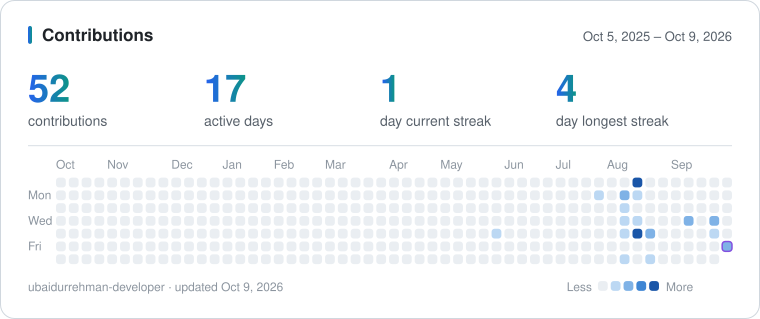

### AI Developer building LLM-powered apps, RAG systems and full-stack products — Lahore, Pakistan.

## 👋 About

I build applications around language models: retrieval-augmented generation with security guardrails, lead-intelligence tooling, and full-stack products delivered to real clients.

I'm open to **full-time AI / ML developer roles** and **freelance projects**. If you have something in mind, [email me](mailto:ubaidurrehman.career.dev@gmail.com).

## 🧰 Tech Stack

  

## 🚀 Featured Projects

| Project | What it does | Stack |
| :-- | :-- | :-- |
| [**RAG Retrieval System**](https://github.com/ubaidurrehman-developer/RAG_Langchain_Project) | Question answering over PDF, DOCX, TXT, Markdown, CSV and JSON documents, with input and output security guardrails that block unsafe prompts and answers | FastAPI, LangChain, ChromaDB, OpenAI |
| [**SaaSquatch Next**](https://github.com/ubaidurrehman-developer/capraecapital_Repo) | B2B lead intelligence: analyses company websites, scores each prospect against an ideal customer profile and drafts outreach emails | FastAPI, BeautifulSoup, SQLite |
| [**Fuel Stop Planner**](https://github.com/ubaidurrehman-developer/Fuel_Stop_Planner) | Django JSON API that plans cost-optimal fuel stops along a US route within a 500-mile tank range, using OSRM routing | Django, OSRM, SQLite |
| [**Ghar ka Zaiqa**](https://github.com/ubaidurrehman-developer/Ghar_ka_zaiqa) | Client project for a home-kitchen business: storefront with chef and admin dashboards and a JWT-authenticated API | React 19, Tailwind, FastAPI, MongoDB |

## 📊 Activity

  <picture>
    <source media="(prefers-color-scheme: dark)" srcset="assets/contributions-dark.svg">
    
  </picture>

  

## 📫 Let's Work Together

- Email: [ubaidurrehman.career.dev@gmail.com](mailto:ubaidurrehman.career.dev@gmail.com)
- LinkedIn: [ubaid-ur-rehman](https://www.linkedin.com/in/ubaid-ur-rehman-5830b324a/)
- Based in Lahore, Pakistan
